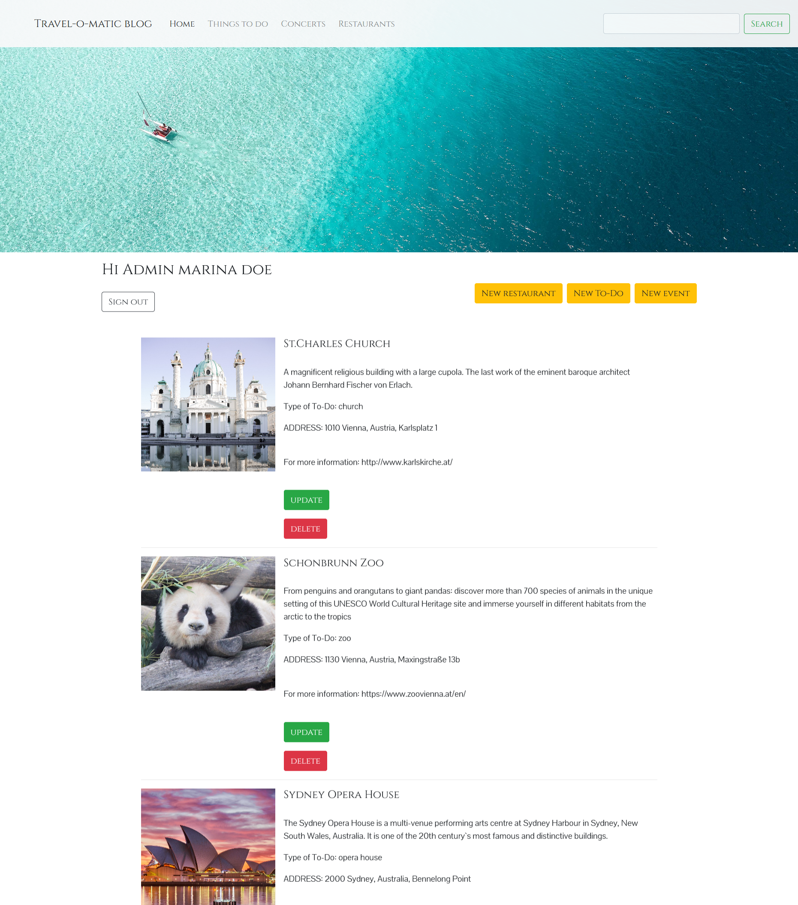

# Bootcamp: PHP CodeReview-11 "Travel-o-matic blog"

  

**A travel blog with a registration and login system.**

The travel blog focuses mainly on three following areas: restaurants, events and other things to do in certain travel destinations (in my case - in Vienna and Sydney).

The website is created using **PHP** and **MySQL database**.

All the data is retrieved from the database.

To see the content on the pages users need to register or login if registration is already completed.

By default every new user is saved in the database as a "user". The database administrator can set the role to the "admin". 

The admin has its own panel with an option of creating, updating and deleting the content on the webpage.

There are two separate SESSIONS for regular users and administrators which prevents unauthorized access to the admin panel.

The travel blog project has a live search field that will search for any result using AJAX.

**// Disclaimer: The whole website is for educational purposes only //**

